# InteractHub - Modern Social Media Platform

InteractHub là một nền tảng mạng xã hội hiện đại, được thiết kế để kết nối mọi người thông qua việc chia sẻ bài viết, hình ảnh, và tương tác thời gian thực. Dự án được xây dựng với kiến trúc Backend (ASP.NET Core) và Frontend (React) tách biệt, đảm bảo hiệu năng cao và khả năng mở rộng.

## 🚀 Tính năng chính

### Người dùng (User)
*   **Xác thực bảo mật**: Đăng ký, đăng nhập với JWT (JSON Web Token).
*   **Bảng tin (Feed)**: Xem bài viết từ cộng đồng và bạn bè.
*   **Tương tác**: Thích (Like), Bình luận (Comment), và Chia sẻ (Share) bài viết.
*   **Kết bạn**: Gửi, nhận và quản lý lời mời kết bạn.
*   **Tìm kiếm toàn cầu**: Tìm kiếm người dùng, bài viết và hashtag.
*   **Khoảnh khắc (Stories)**: Chia sẻ những mẩu tin ngắn biến mất sau 24h.
*   **Thông báo thực**: Nhận thông báo tức thời (SignalR) khi có tương tác mới.

### Quản trị viên (Admin)
*   **Dashboard chuyên biệt**: Giao diện quản lý riêng với thanh Sidebar tiện lợi.
*   **Quản lý báo cáo**: Xét duyệt và xử lý các bài viết bị người dùng báo cáo vi phạm.
*   **Quản lý nội dung**: Giám sát và xóa các bài viết không phù hợp trực tiếp từ danh sách hệ thống.

---

## 🛠 Công nghệ sử dụng

*   **Backend**: .NET 8 Web API, Entity Framework Core, SQL Server, SignalR, BCrypt.NET.
*   **Frontend**: React (Vite), TypeScript, Tailwind CSS, Lucide Icons, Axios.
*   **Cơ sở dữ liệu**: SQL Server.

---

## 💻 Hướng dẫn cài đặt

### Yêu cầu hệ thống
*   [.NET 8.0 SDK](https://dotnet.microsoft.com/download/dotnet/8.0)
*   [Node.js](https://nodejs.org/) (v18 trở lên)
*   [SQL Server](https://www.microsoft.com/en-us/sql-server/sql-server-downloads)

### 1. Thiết lập Backend
1.  Truy cập vào thư mục backend: `cd Backend/Backend`
2.  Cấu hình chuỗi kết nối cơ sở dữ liệu trong file `appsettings.json`:
    ```json
    "ConnectionStrings": {
      "DefaultConnection": "Server=YOUR_SERVER;Database=InteractHub;Trusted_Connection=True;..."
    }
    ```
3.  Cập nhật cơ sở dữ liệu (Migration):
    ```bash
    dotnet ef database update
    ```
4.  Chạy ứng dụng:
    ```bash
    dotnet run
    ```

### 2. Thiết lập Frontend
1.  Truy cập vào thư mục frontend: `cd Frontend`
2.  Cài đặt các phụ thuộc (Dependencies):
    ```bash
    npm install
    ```
3.  Chạy ứng dụng trong môi trường phát triển:
    ```bash
    npm run dev
    ```
4.  Mở trình duyệt và truy cập: `http://localhost:5173`

---

## 📊 Sơ đồ cơ sở dữ liệu (ERD)

> [!NOTE]
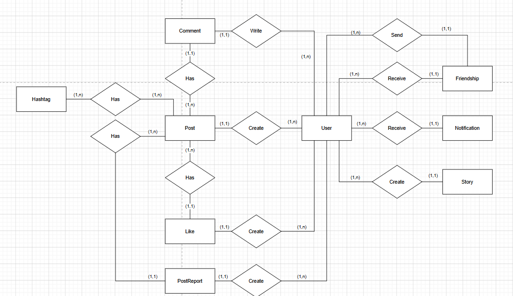

---

## 📜 Tài liệu API (Endpoints)

> [!TIP]
> *Hệ thống đã tích hợp Swagger. Bạn có thể xem tài liệu API chi tiết tại:* `http://localhost:5263/swagger` (hoặc cổng tương ứng của bạn).

### 🔐 Xác thực (Authentication)
* `POST /api/auth/register`: Đăng ký tài khoản người dùng mới.
* `POST /api/auth/login`: Đăng nhập và nhận mã định danh JWT Token.

### 📝 Bài viết & Tương tác (Posts & Interactions)
* `GET /api/posts`: Lấy danh sách bài viết (Hỗ trợ phân trang).
* `POST /api/posts`: Tạo bài viết mới kèm hình ảnh.
* `DELETE /api/posts/{id}/admin`: (Admin) Xóa bài viết vi phạm trực tiếp.
* `POST /api/likes/toggle/{postId}`: Thích hoặc bỏ thích một bài viết.
* `GET /api/posts/{postId}/comments`: Xem danh sách bình luận của bài viết.
* `POST /api/posts/{postId}/comments`: Gửi bình luận mới.

### 👥 Bạn bè & Người dùng (Friendships & Users)
* `GET /api/user/profile/{id}`: Xem thông tin chi tiết hồ sơ người dùng.
* `PUT /api/user/settings`: Cập nhật thông tin cá nhân và ảnh đại diện/ảnh bìa.
* `POST /api/friendships/request/{receiverId}`: Gửi lời mời kết bạn.
* `POST /api/friendships/accept/{senderId}`: Chấp nhận lời mời kết bạn.
* `GET /api/friendships/suggestions`: Gợi ý những người bạn có thể biết.

### 🎬 Khoảnh khắc & Tìm kiếm (Stories & Search)
* `GET /api/stories`: Lấy danh sách Stories mới nhất từ bạn bè.
* `POST /api/stories`: Đăng tải khoảnh khắc mới (tự động hết hạn).
* `GET /api/search?q={keyword}`: Tìm kiếm người dùng và bài viết toàn cục.
* `GET /api/hashtags/trending`: Lấy danh sách các Hashtags thịnh hành nhất.

### 🛡️ Quản lý & Báo cáo (Admin & Reports)
* `GET /api/postreports`: (Admin) Xem danh sách các bài viết bị người dùng báo cáo.
* `POST /api/postreports`: Gửi báo cáo vi phạm đối với nội dung không phù hợp.
* `GET /api/notifications`: Lấy danh sách thông báo thời gian thực (SignalR).

---
## 📸 Giao diện & Tính năng chính

### 🔐 Xác thực người dùng
Giao diện đăng nhập và đăng ký được thiết kế tối giản, hiện đại và bảo mật.
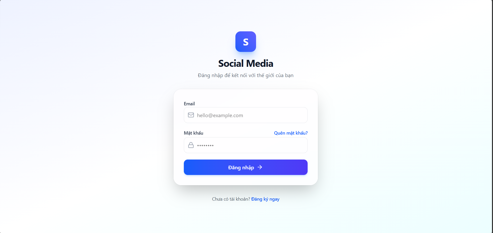
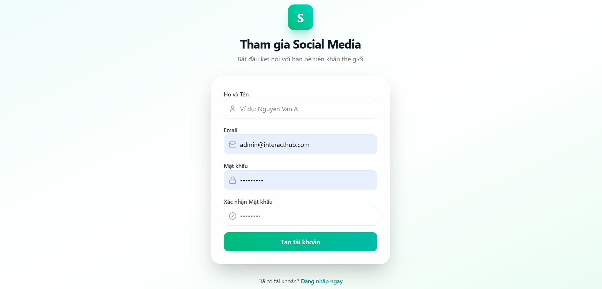

---

### 🏠 Bảng tin (Feed) & Bài viết
Trang chủ hiển thị các bài viết mới nhất. Người dùng có thể dễ dàng tạo bài viết mới với hình ảnh.
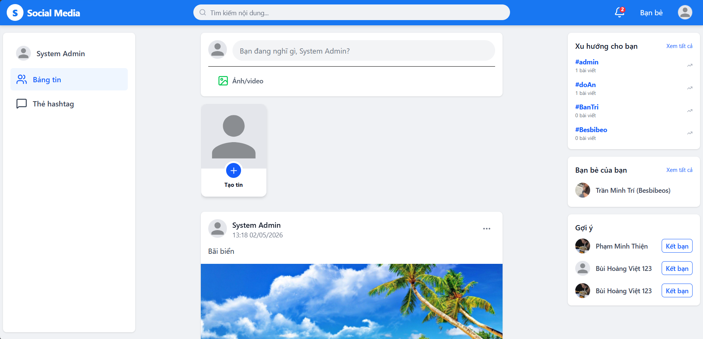
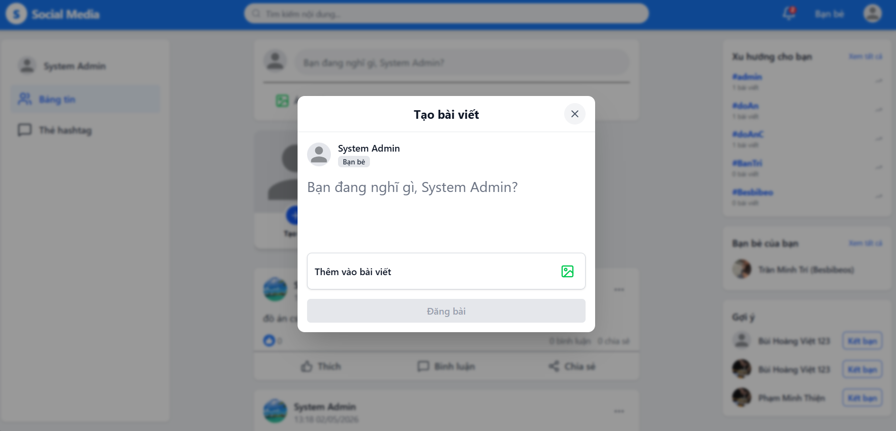

---

### 💬 Chi tiết bài viết & Tương tác
Xem chi tiết bài viết, các lượt thích và danh sách bình luận.
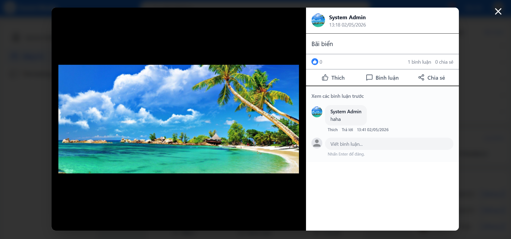

---

### 👤 Trang cá nhân & Bạn bè
Trang cá nhân hiển thị thông tin và các bài viết của người dùng. Hệ thống bạn bè giúp kết nối mọi người dễ dàng.
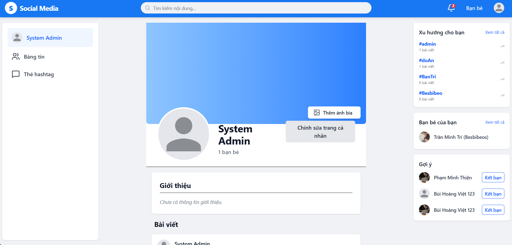
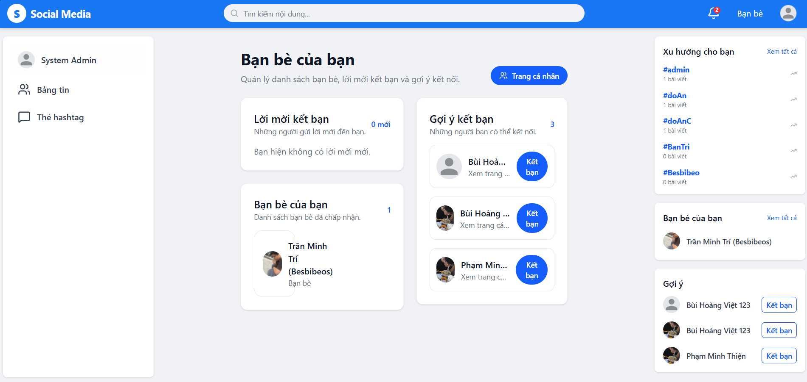

---

### 📱 Khoảnh khắc (Stories)
Chia sẻ những hình ảnh, khoảnh khắc ngắn trong ngày.
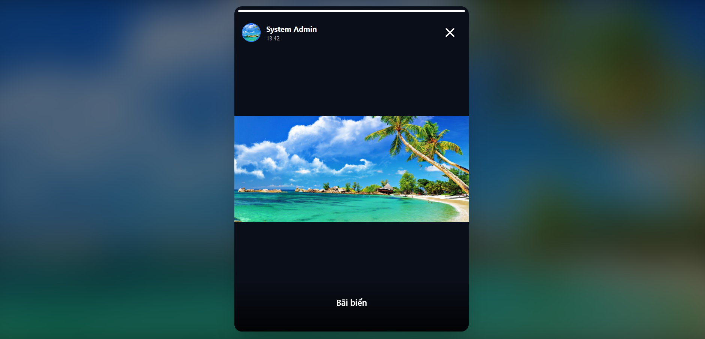

---

### 🔍 Tìm kiếm & Hashtags
Tìm kiếm người dùng, bài viết hoặc khám phá các chủ đề thông qua Hashtags.
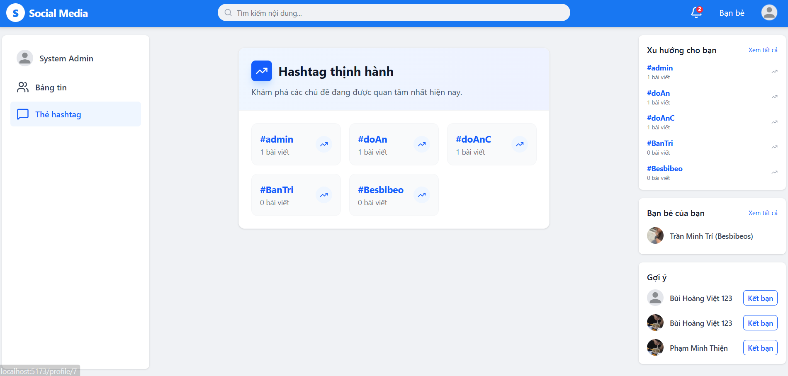

---

### 🛡 Quản trị viên (Admin)
Hệ thống quản trị mạnh mẽ giúp kiểm soát nội dung và người dùng hiệu quả.
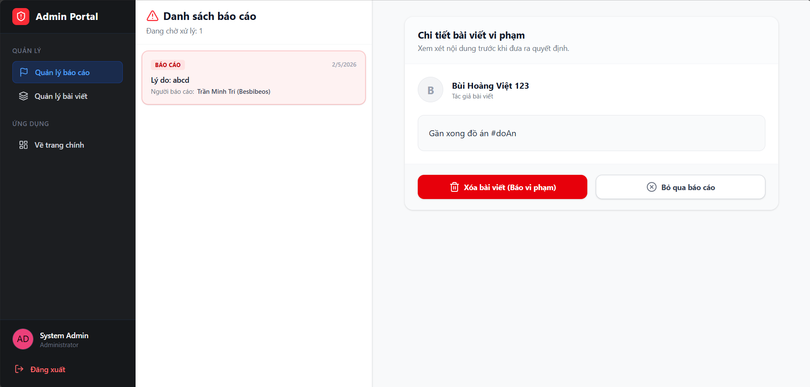


## 📄 Giấy phép

Dự án này được phát triển cho mục đích học tập và xây dựng cộng đồng.
